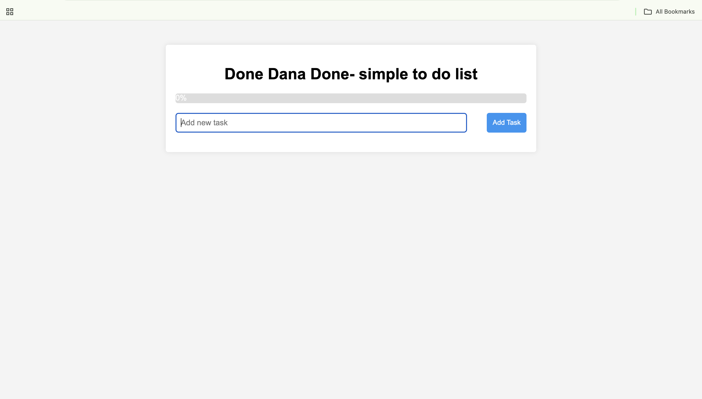
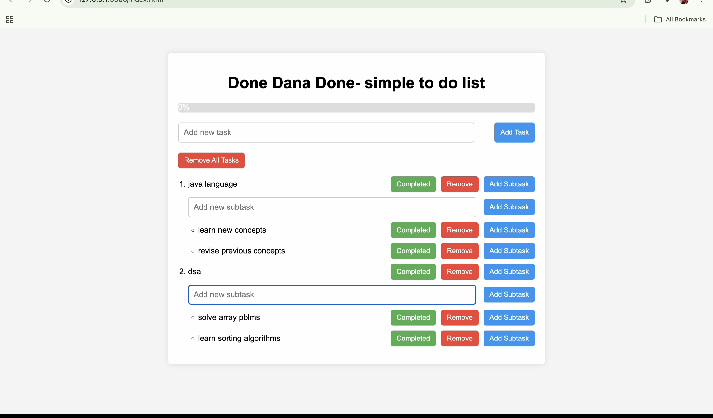
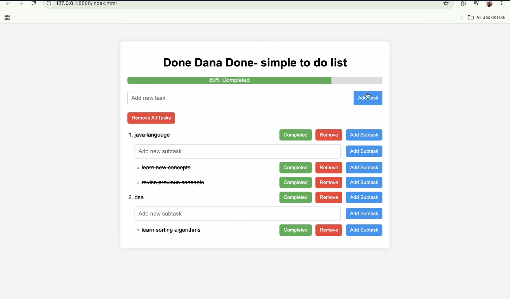

# ✅ Done Dana Done

**Done Dana Done** is a simple and efficient task management application designed to help users organize, manage, and complete their daily tasks with ease.

> 🚧 This project is currently under development and will continue to evolve with new features in future versions.

---
## 🎥 Demo

Watch the project demo here: https://www.youtube.com/watch?v=qnrJbukqjtY

---
## 📸 Screenshots

Preview of the application's interface and core functionality.
### 🏠 Home Page


### ➕ Adding a Task


### ✅ Completed Task


---

## ✨ Features

- ✅ Add Tasks
- ✏️ Edit Tasks
- 🗑️ Delete Tasks
- ✔️ Mark Tasks as Completed
- 📋 Simple & Clean User Interface
- 📱 Responsive Design

---

## 🚀 Upcoming Features

- 📅 Calendar Integration
- 🔥 Task Categories
- 🏷️ Priority Levels
- ⏰ Due Dates & Reminders
- 🌙 Dark Mode
- 📊 Progress Dashboard
- 📈 Weekly & Monthly Planning
- 🤖 AI-Powered Task Scheduling
- 📄 PDF-Based Study Planner
- 📝 Smart Notes
- 💬 AI Learning Assistant (RAG)

---

## 🛠️ Tech Stack

- HTML
- CSS
- JavaScript

---

## 📂 Project Structure

```
done-dana-done/
│
├── index.html
├── style.css
├── app.js
├── README.md
└── screenshots/
```

---

## 🎯 Project Vision

Done Dana Done is planned to evolve beyond a simple to-do list into an AI-powered productivity and study planning platform.

Future versions aim to help users:
- Generate study plans automatically
- Organize daily schedules
- Adapt tasks based on learning speed
- Reschedule missed tasks intelligently
- Build AI-assisted notes and learning workflows

---

## 📌 Version

**Current Version:** v1.0

---

## ⭐ Support

If you like this project, consider giving it a ⭐ on GitHub!
